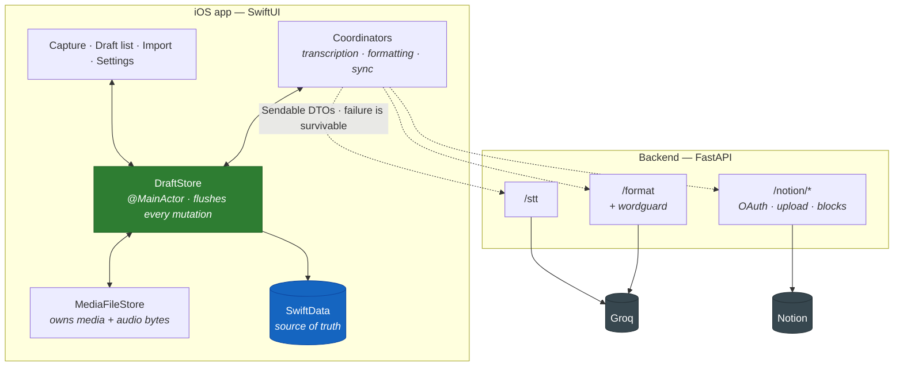

# AutoReflect

> Capture first. Organize later. Sync whenever.

A local-first iOS journaling app that will not lose your words. Talk at it, type into it,
throw photos at it, go through a tunnel, force-quit it, restore your phone from a backup —
the entry is still there.

Everything else it does (transcription, AI structuring, syncing to Notion) is optional
decoration on top of that one promise.

---

## The problem

I've journaled every day for six years using a system I call **WWWT — What Went Well Today**.
The system works. The tooling did not.

| What kept happening | Why it happened |
|---|---|
| Two minutes of dictation vanished when a call came in | The app only saved when the transcript came back |
| A refresh ate the entry | Text lived in a text box, not on disk |
| One oversized photo failed the whole upload | Media and text shared a fate they had no business sharing |
| The AI "cleaned up" my writing into someone else's voice | Nothing checked its output against mine |
| I stopped dictating the interesting parts | Because I no longer trusted it to keep them |

That last row is the actual cost. An unreliable capture tool doesn't just lose entries, it
quietly teaches you to write less. This project exists to make that specific anxiety go away.

## The promise, stated precisely

Four tenets, in priority order — when they conflict, the higher number loses:

1. **Never lose what the user said or wrote.** Beats correctness elsewhere, beats
   convenience, beats performance.
2. **Local-first.** Every action commits to the on-device store immediately. The backend is
   never consulted to decide whether a local write may proceed.
3. **AI assists, never authors.** It groups and structures your words. It does not choose
   different ones. There is deliberately no code path from formatting back to your raw text.
4. **Sync is optional.** An entry that never leaves the phone is complete and valid.

These aren't aspirations in a doc. They're the reason for most of the non-obvious code, and
they're enforced in [tests](#the-tests-are-the-product) that simulate the failures rather
than assume they won't happen.

---

## What it actually does

### Capture without thinking about it

Type or dictate. Text commits to disk on a ~300ms debounce, and *immediately* on anything
that could end the session — leaving the screen, backgrounding, starting a recording. The
save state is on screen because "is my writing safe?" should never be a question you have to
wonder about.

**Dictation is durable before it is useful.** The audio file is written and committed
*before* transcription is attempted, and deleted only once its text is merged into the entry
and that write is saved. If transcription fails, you still have the recording. If the app
dies mid-transcription, the queue picks it up on next launch. This is the founding bug of the
project and the design bends around it.

### Structuring that can't rewrite you

Hit ✨ and your entry gets grouped into a bullet hierarchy — related thoughts together,
supporting details nested under the point they support.

What it will fix: typos, doubled letters, words run together, capitalisation.
`softwaaarre` → `software`. `Sinceqwhendideggsbecomesoexpensive?` → `Since when did eggs
become so expensive?`

What it will not do: swap in a nicer word, add a transition, drop a line it judged
unimportant, or make your slang more presentable. `gonna` stays `gonna`.

That's not a prompt asking nicely — the prompt asks, but
[`wordguard.py`](backend/app/wordguard.py) *enforces*. It diffs the model's output against
your input word by word; output that invented or dropped words is rejected before it reaches
you. A word you deliberately spell your own way can be marked protected, and the guard will
refuse to let it be "corrected".

Your raw text is never touched either way. The structured version lives alongside it, and
you can edit it by hand.

### Photos and video, without the size roulette

Attach media in bulk, view it full-screen in a sheet you can scroll through *while still
typing* — because looking at the day's photos is how you remember what to write about.

Notion's free tier caps uploads at 5 MiB. Rather than failing, media is transcoded on device
to fit — bitrate-targeted H.265 with an H.264 fallback, and downsampled stills. And if one
attachment still can't be sent, **it fails alone**: the entry and everything else in it go
through, and the failure is reported rather than swallowed.

### Import by date — the feature I actually wanted

The real workflow problem: I take photos all week and journal on Sunday, then have to
remember which day each photo belongs to.

So: bulk-select a few hundred photos, and the app reads each one's capture date and groups
them by day. For each day it offers the entries you already have for that date, or lets you
name a new one. Ten minutes of scrolling through Photos becomes about four taps.

### Notion, properly

Sign in with OAuth, pick a database, done — no pasting API keys anywhere. **Tokens live
server-side only** (`0600`, never returned to the device); the app knows a boolean, a
workspace name, and which database you chose.

Every entry becomes its own page. (It didn't always — an early version keyed pages by date
and cheerfully overwrote a hand-written entry that shared a date with a draft. Page identity
is the *draft* now, and there's an ADR about it.) You can also point a draft at an existing
page to append to, in which case the app touches only the blocks it wrote and leaves your
page's own properties alone.

Nested bullets survive the trip. Long entries are chunked to fit Notion's limits
(2000 chars per rich-text object, 100 children per request). And when it's synced, there's a
button that opens the actual page.

### Sync that can be interrupted

Sync is a four-phase state machine that records how far it got, so a retry **resumes** rather
than restarting — restarting is what creates duplicates. Every mutating call carries an
idempotency key derived from a stable attempt ID, so a lost response followed by a retry
replays the original result instead of writing a second copy.

A crash mid-sync doesn't strand the entry either: `startedAt` is a lease, and launch
reconciliation reclaims anything a dead process left marked "syncing".

---

## The tests are the product

Two suites, ~150 tests, run in under a second with no simulator:

**Invariants** — the rules the domain must never break.

**Adversarial durability** — the interesting ones. Process death mid-dictation. A relocated
app container (which is what restore-from-backup looks like from the inside). A lost response
after a successful insert. An interrupted upload. A transcription that fails permanently.
An entry edited between sync attempts. A migration from a store an older build wrote.

There's a test asserting that no user-facing failure message ever implies work was lost —
because it never is.

```bash
cd Core && swift test          # ~150 tests, headless
cd backend && .venv/bin/python -m pytest -q   # ~130 tests
```

When adding anything that touches persistence or sync, **add the failure-mode test, not just
the happy path.** Every bug this project has shipped got through because something failed
silently: a `try?`, a missing `switch` case, an over-eager success path.

---

## Architecture



**Solid lines must never fail. Dotted lines may fail freely** — a draft is complete and valid
whether or not any of them ever succeeds. That split is the whole architecture in one
picture.

Three rules hold the concurrency together:

- **Saves are explicit.** SwiftData autosave commits at *opportune moments*, which never
  arrive during a long foreground dictation. Every mutating method on `DraftStore` calls
  `flush()` before returning.
- **All model mutation happens on the main actor.** `@Model` types aren't `Sendable`.
  Service boundaries pass `Sendable` DTOs and never a model; callers re-fetch by `UUID`.
  Swift 6 language mode is on, so the unsafe shape fails to compile rather than failing in
  the field.
- **Coordinators share one shape:** snapshot values on the main actor, await the service,
  re-fetch by `UUID`, and discard the result if the content moved on while it ran.

### Layout

```
CodenamePromise/          SwiftUI app target (file-system synchronized group —
  App/                    adding a file needs no project edit)
  Views/Capture/          editor, dictation, media viewer, compression
  Views/Draft/            list grouped by entry day
  Views/Import/           bulk photo import by capture date
  Views/Settings/         Notion connect + database picker
Core/                     Swift package — builds and tests without a simulator
  Sources/CodenamePromiseCore/
    Domain/               CalendarDay, EntryContent, text merge, enums
    Models/               EntryDraft (aggregate root), MediaItem, AudioCapture, SyncState
    Persistence/          versioned Schema, DraftStore, MediaFileStore
    Services/             DTO-shaped protocol definitions
    Networking/           APIClient, HTTP implementations, reachability
    Coordination/         transcription queue, formatting, resumable sync
    Security/             Keychain
  Tests/                  invariants + adversarial durability
backend/                  Python/FastAPI — monorepo, so the wire contract versions together
  app/wordguard.py        "AI assists, never authors", enforced
  app/blocks.py           markdown → Notion blocks, nested and chunked
  app/idempotency.py      replay, don't re-write
docs/architecture/        domain model, flows, decision register
```

The domain and persistence layers live in a package so they build and test headlessly. The
app target depends on it and adds only UI.

---

## Running it

```bash
make test          # both suites
make server        # FastAPI on :8000
make app           # build + install + launch on the simulator
make device        # same, on a connected iPhone (signed, with your LAN IP baked in)
```

The backend **runs with no credentials at all.** `EchoTranscriber`, `PassthroughFormatter`
and `InMemoryNotion` sit behind protocols, so the whole client is developable with zero keys
and no network. `GET /health` tells you which providers are live.

Real providers activate from configuration:

| Provider | Env var | What it does |
|---|---|---|
| Groq | `GROQ_API_KEY` | `whisper-large-v3-turbo` for dictation, `llama-3.3-70b-versatile` for structuring |
| Notion | OAuth | activates once you sign in and pick a database |

Groq's API is OpenAI-compatible, so the base URL is the only thing tying it to Groq.

Point the app at a backend with the `BACKEND_BASE_URL` build setting. **Leaving it unset is a
supported state**, not an error — the app then behaves exactly as it does offline: capture
works, everything else queues visibly and syncs when it can.

> One trap, documented because it cost a day: don't use `INFOPLIST_KEY_BackendBaseURL`. That
> mechanism only handles Apple's known key names and silently discards custom ones. The build
> succeeds, the key is absent, and the app can never reach its backend.

### Stack

| Area | Technology |
|---|---|
| App | Swift 6, SwiftUI, iOS 17+ |
| Storage | SwiftData, versioned schema with migration plan |
| Concurrency | Swift 6 language mode, all model writes main-actor |
| Backend | Python, FastAPI, Pydantic v2 |
| AI | Groq — Whisper for dictation, Llama for structuring |
| Media | On-device `ImageIO` and `AVFoundation` |
| Integration | Notion API (OAuth 2.0) |

---

## Documentation

- **[Decision register](docs/architecture/decisions.md)** — every architectural decision, the
  concrete failure it prevents, and three that were rejected. Source comments cite `ADR-NNN`
  throughout and the numbers resolve here. Several fields look redundant and are not; read
  the ADR before changing one.
- **[Domain model](docs/architecture/domain-model.md)** — the aggregate, its invariants, and
  what each non-obvious field is defending against.
- **[Flows](docs/architecture/flows.md)** — dictation, sync resumption, launch
  reconciliation, offline behaviour.

An earlier iteration of the spec targeted React Native / Expo with SQLite. That's historical;
the decision register records what changed and why.
