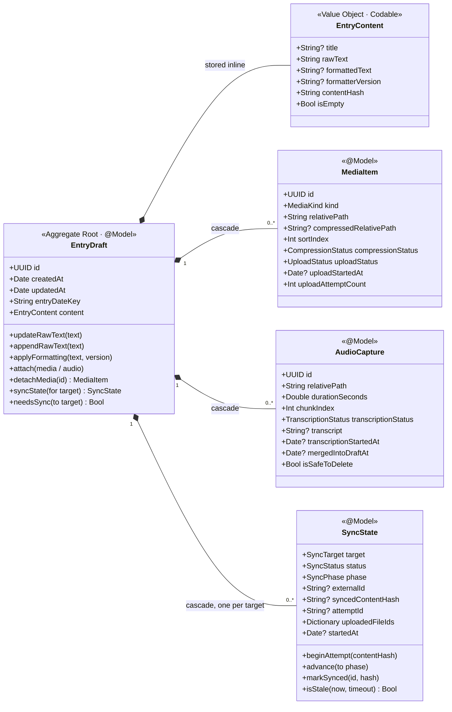

# Domain model

> Capture first. Organize later. Sync whenever.

`EntryDraft` is the aggregate root. It is never replaced, only enriched. Everything else in
the system exists to create, enrich, format, persist or synchronize one.

The authoritative definition is the code in
[`Core/Sources/CodenamePromiseCore/Models`](../../Core/Sources/CodenamePromiseCore/Models).
This document explains the shape and, more importantly, *why* it is that shape — several
fields exist purely to close a data-loss or corruption hole and look redundant without that
context. Each carries an ADR reference; see [decisions.md](decisions.md).

---

## Aggregate

`EntryContent` is a `Codable` value stored as a single attribute, **not** a separate
`@Model`. As an entity it had an implicit to-one relationship with no delete rule, so
deleting a draft orphaned its content row permanently (ADR-010).

---

## What each unusual field is for

| Field | Exists because |
|---|---|
| `entryDateKey` | A daily journal needs the day it is *about*, not the instant it was created. Journaling at 00:30 about yesterday must file under yesterday, and it identifies the destination page. `yyyy-MM-dd` so string order is chronological order. (ADR-006) |
| `EntryContent.contentHash` | Sync dirtiness cannot use timestamps: `updatedAt` bumps on every mutation, so a sync recording its own completion would re-dirty itself and loop forever. (ADR-016) |
| `formatterVersion` | Formatting output stays reproducible when the prompt changes. (ADR-017) |
| `relativePath` (both models) | Absolute paths break on restore-from-backup — the container UUID changes — and `PhotosPicker` temp URLs get purged. Bytes are copied into the container and referenced relatively. (ADR-007) |
| `MediaItem.sortIndex` | SwiftData to-many relationships are set-backed, so array order is incidental and can change between launches. Photo order is user-visible. (ADR-011) |
| `compressionStatus` separate from `uploadStatus` | One combined field made "needs compressing" indistinguishable from "needs uploading", leaving any retry pass unable to decide what to do. (ADR-013) |
| `uploadStartedAt` / `transcriptionStartedAt` / `SyncState.startedAt` | Leases. Without them a process death mid-operation leaves the record claiming to be in flight forever, and `.syncing` means "don't retry" — a permanently stuck draft. (ADR-004) |
| `AudioCapture.mergedIntoDraftAt` | Audio may only be deleted once its words are durably part of the draft. |
| `SyncState.attemptId` | Idempotency key. `insert-content` is not idempotent, so a lost `200` plus a retry would insert the entry twice. (ADR-003) |
| `SyncState.phase` / `uploadedFileIds` / `insertedBlockIds` | Let an interrupted multi-step sync resume instead of restarting. Restarting is what duplicates. (ADR-005) |
| `*Raw` string properties | Enum-typed SwiftData properties have been unreliable inside `#Predicate`, and the retry queues are exactly those predicates. Raw storage, bridged enum accessors. (ADR-012) |

---

## Invariants

These are enforced in code and covered by tests in
[`DomainInvariantTests.swift`](../../Core/Tests/CodenamePromiseCoreTests/DomainInvariantTests.swift).

1. `id` and `createdAt` are immutable after creation.
2. `updatedAt` changes on every **content** mutation. **Amended (ADR-016):** sync
   bookkeeping is explicitly excluded — recording a successful sync is not a content
   change. Without this carve-out, dirty-detection loops forever.
3. `rawText` is written only by the user. No code path leads from formatting to it.
4. `formattedText` is optional and freely regenerable.
5. Media is additive: attach and detach only, never modify a file in place.
6. At most one `SyncState` per `SyncTarget`, enforced by `EntryDraft.syncState(for:)` —
   the only sanctioned way to create one. SwiftData cannot express a uniqueness constraint
   scoped to a parent, so nothing else may append to `syncStates`.
7. `SyncState.externalId` is how a draft round-trips to its destination.
8. **New:** dictation audio is durable on disk *before* transcription is attempted, and is
   released only once its transcript is committed to the draft. (ADR-002)
9. **New:** media bytes live in the app container under a relative path from the moment of
   attach. A model never references a file it does not own. (ADR-007)

---

## Persistence layout

```mermaid
flowchart TB
    subgraph device["On device — the source of truth"]
        direction TB
        sqlite[("SwiftData store<br/>drafts · media rows · audio rows · sync rows")]
        files[("App container / Media<br/>media&#47;&lt;uuid&gt;&#47;original.heic<br/>media&#47;&lt;uuid&gt;&#47;dictation.m4a")]
    end

    subgraph code["Core package"]
        store["DraftStore<br/><i>@MainActor · explicit saves</i>"]
        fileStore["MediaFileStore<br/><i>owns the bytes</i>"]
    end

    subgraph backend["Backend — a destination, never the datastore"]
        api["FastAPI<br/>&#47;stt · &#47;format · &#47;notion&#47;*"]
    end

    store -->|"commits after every mutation"| sqlite
    fileStore -->|"atomic writes"| files
    store -.->|"relative paths only"| fileStore
    store -.->|"Sendable DTOs, never @Model"| api
    api -.->|"results applied on the main actor"| store
```

The database holds paths; the file store holds bytes. Neither knows about the backend, and
the backend is never consulted to decide whether a local write may proceed.
