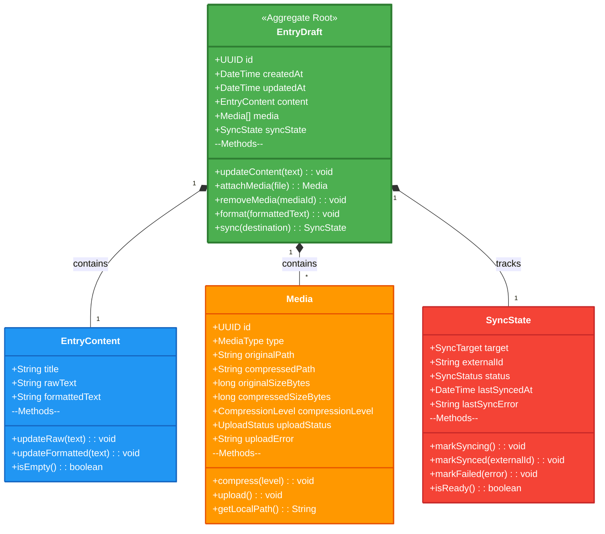
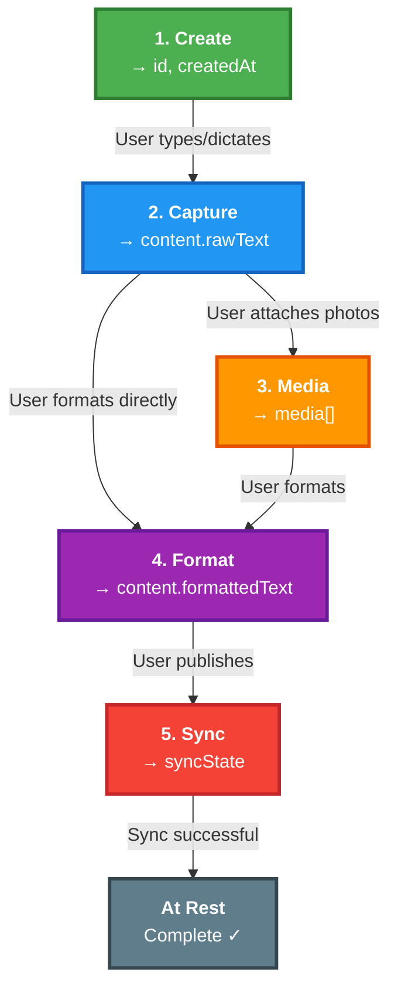
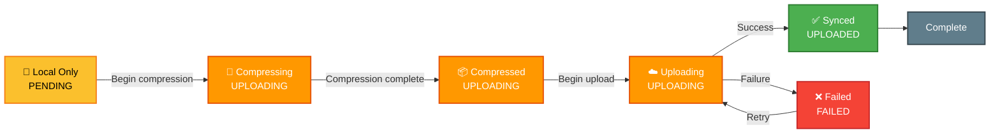

# Domain Models

The `EntryDraft` is the central aggregate root in Codename Promise. All other entities exist to enrich or track the state of this aggregate.

**Note:** These domain models are shared between React Native frontend (TypeScript) and Python backend (Pydantic/SQLAlchemy). Both implementations follow the same schema and invariants.

## Core Domain Model



## Complete Workflow Visualization



**Key Observations:**

- Steps are not always linear (you can format before attaching media)
- You can repeat steps (format multiple times, add media after formatting)
- Sync is optional and can happen anytime
- Every step persists immediately to SQLite

---

## Aggregate: EntryDraft

The `EntryDraft` is the single source of truth for a journal entry. It is never replaced, only enriched.

### Structure

```typescript
{
  // Identity
  id: UUID,

  // Lifecycle
  createdAt: DateTime,
  updatedAt: DateTime,

  // Content (composition)
  content: {
    title?: String,
    rawText: String,           // User's original input (typed or dictated)
    formattedText?: String     // AI-formatted version
  },

  // Attachments (composition)
  media: [
    {
      id: UUID,
      type: MediaType,          // PHOTO | VIDEO
      originalPath: String,
      compressedPath?: String,
      originalSizeBytes: Long,
      compressedSizeBytes?: Long,
      compressionLevel: NONE | LOW | MEDIUM | HIGH,
      uploadStatus: PENDING | UPLOADING | UPLOADED | FAILED,
      uploadError?: String
    }
  ],

  // Sync tracking (composition)
  syncState: {
    target: NOTION | EVERNOTE | OBSIDIAN,
    externalId?: String,       // e.g., Notion page ID
    status: PENDING | SYNCING | SYNCED | FAILED,
    lastSyncedAt?: DateTime,
    lastSyncError?: String
  }
}
```

### Invariants (Business Rules)

These invariants are always maintained:

1. **id is immutable** - Never changes after creation
2. **createdAt is immutable** - Set only on creation
3. **updatedAt changes on every mutation** - Always reflects last change
4. **rawText persists unchanged** - Never modified by formatting
5. **formattedText is optional** - Can be empty or None
6. **Media is additive** - Can only add/remove, not modify individual files
7. **Only one syncState per target** - Can have multiple sync states for different destinations
8. **syncState tracks external IDs** - Links back to synced destinations

---

## Value Object: EntryContent

Represents the textual content of an entry at different stages of enrichment.

### Composition

```typescript
{
  title?: String,              // Optional: user-provided title
  rawText: String,             // Required: user's direct input (typed or dictated)
  formattedText?: String       // Optional: AI-structured version
}
```

### Semantics

| Field             | Purpose                       | Source           | Mutability                                |
| :---------------- | :---------------------------- | :--------------- | :---------------------------------------- |
| **title**         | User-provided heading         | Manual entry     | Mutable                                   |
| **rawText**       | User's unaltered capture      | Typing/Dictation | Mutable (only appended or edited by user) |
| **formattedText** | Structured & polished version | GPT API          | Mutable (can reformat)                    |

### Methods

```typescript
updateRaw(text: String): void
  // Appends or overwrites rawText
  // Called after typing/dictation capture
  // Preserves exact user input

updateFormatted(text: String): void
  // Sets formattedText from GPT response
  // Called after formatting request
  // Can be called multiple times (reformatting)

isEmpty(): boolean
  // Returns true if both raw and formatted are empty
```

---

## Value Object: Media

Represents a single piece of media (photo or video) attached to an entry.

### Composition

```typescript
{
  id: UUID,                          // Unique identifier
  type: MediaType,                   // PHOTO | VIDEO

  // Local storage paths
  originalPath: String,              // Local filesystem path to original file
  compressedPath?: String,           // Local filesystem path to compressed version

  // Size tracking
  originalSizeBytes: Long,           // Original file size in bytes
  compressedSizeBytes?: Long,        // Compressed file size in bytes
  compressionLevel: CompressionLevel,// NONE | LOW | MEDIUM | HIGH

  // Upload tracking
  uploadStatus: UploadStatus,        // PENDING | UPLOADING | UPLOADED | FAILED
  uploadError?: String               // Error message if upload failed
}
```

### Upload Lifecycle



### Compression Strategy

| Level      | Use Case              | Approximate Reduction |
| :--------- | :-------------------- | :-------------------- |
| **NONE**   | Keep original         | 0% (no compression)   |
| **LOW**    | High quality needed   | 20-40%                |
| **MEDIUM** | Standard journaling   | 50-70%                |
| **HIGH**   | Bandwidth constrained | 80-90%                |

---

## Value Object: SyncState

Tracks the synchronization status of an entry with external destinations.

### Composition

```typescript
{
  target: SyncTarget,         // Destination service (NOTION, EVERNOTE, OBSIDIAN, etc.)
  externalId?: String,        // ID of synced resource (e.g., Notion page UUID)
  status: SyncStatus,         // State of sync
  lastSyncedAt?: DateTime,    // When last successful sync occurred
  lastSyncError?: String      // Error message from last failed sync
}
```

### Sync Status States


### Multiple Sync Targets

An `EntryDraft` can be synced to multiple destinations independently:

```typescript
{
  // EntryDraft can have multiple SyncStates
  syncStates: [
    {
      target: NOTION,
      externalId: "notion-page-uuid-123",
      status: SYNCED,
      lastSyncedAt: 2024-01-15T10:30:00Z
    },
    {
      target: EVERNOTE,
      externalId: "evernote-note-456",
      status: SYNCED,
      lastSyncedAt: 2024-01-15T10:32:00Z
    },
    {
      target: OBSIDIAN,
      status: FAILED,
      lastSyncError: "Connection timeout",
      lastSyncedAt: 2024-01-15T10:20:00Z
    }
  ]
}
```

---

## Enumerations

### MediaType

```
PHOTO = "photo"
VIDEO = "video"
```

### CompressionLevel

```
NONE = "none"
LOW = "low"
MEDIUM = "medium"
HIGH = "high"
```

### UploadStatus

```
PENDING = "pending"       // Queued for upload
UPLOADING = "uploading"   // Currently uploading
UPLOADED = "uploaded"     // Successfully uploaded
FAILED = "failed"         // Upload failed, needs retry
```

### SyncTarget

```
NOTION = "notion"
EVERNOTE = "evernote"
OBSIDIAN = "obsidian"
```

### SyncStatus

```
PENDING = "pending"       // Not yet synced
SYNCING = "syncing"       // Sync in progress
SYNCED = "synced"         // Successfully synced
FAILED = "failed"         // Sync failed
```

---

## Hydration

The `EntryDraft` is progressively hydrated throughout the journaling workflow. Each user action enriches one or more parts of the aggregate.

### Enrichment Timeline

| User Action       | Fields Updated                        | Before         | After                  |
| :---------------- | :------------------------------------ | :------------- | :--------------------- |
| **Create Draft**  | `id`, `createdAt`                     | ∅              | Minimal aggregate      |
| **Type**          | `content.rawText`, `updatedAt`        | Empty          | Has raw text           |
| **Dictate**       | `content.rawText`, `updatedAt`        | Empty          | Has transcribed text   |
| **Edit Text**     | `content.rawText`, `updatedAt`        | Outdated       | Refined input          |
| **Upload Media**  | `media[]`, `updatedAt`                | No attachments | Media attached         |
| **Format Entry**  | `content.formattedText`, `updatedAt`  | Only raw text  | Raw + formatted        |
| **Publish Entry** | `syncState.*`, `updatedAt`            | Not synced     | Synced with externalId |
| **Retry Sync**    | `syncState.status`, `syncState.error` | Failed         | Retry initiated        |

### Example: Complete Hydration Sequence

```
1. Initial State (after create)
   {
     id: "abc-123",
     createdAt: 2024-01-15T09:00:00Z,
     content: { rawText: "", formattedText: undefined },
     media: [],
     syncState: { target: NOTION, status: PENDING }
   }

2. After typing (after capture)
   {
     ...
     updatedAt: 2024-01-15T09:05:00Z,
     content: {
       rawText: "Today was a good day...",
       formattedText: undefined
     }
   }

3. After attaching photo (after media)
   {
     ...
     updatedAt: 2024-01-15T09:10:00Z,
     media: [{
       id: "media-456",
       type: PHOTO,
       originalPath: "/storage/photos/photo_001.jpg",
       compressedPath: "/storage/photos/photo_001_compressed.jpg",
       uploadStatus: UPLOADED
     }]
   }

4. After formatting (after GPT)
   {
     ...
     updatedAt: 2024-01-15T09:15:00Z,
     content: {
       rawText: "Today was a good day...",
       formattedText: "### Today's Reflection\n- Good day overall\n- Key moments: ..."
     }
   }

5. After sync (after Notion publish)
   {
     ...
     updatedAt: 2024-01-15T09:20:00Z,
     syncState: {
       target: NOTION,
       externalId: "notion-page-789",
       status: SYNCED,
       lastSyncedAt: 2024-01-15T09:20:00Z
     }
   }
```

---

## Guiding Principles

### ✅ Never Replace

- The `EntryDraft` is never replaced
- Each operation incrementally enriches the existing aggregate
- Historical data is always preserved

### ⚡ Persist Immediately

- Every mutation is immediately persisted to SQLite
- No in-memory state waiting for sync
- Crashes cannot cause data loss

### 🌍 Synchronization is a Side Effect

- Sync failures never destroy work
- The `EntryDraft` exists independently of Notion
- Sync can always happen later

### 🎯 Single Source of Truth

- The `EntryDraft` in SQLite is canonical
- No scattered state across systems
- All features enrich this single aggregate

### 👤 User's Voice Always Wins

- `rawText` preserves exact user input
- Formatting never changes user's voice
- AI assists, never authors

---

## Database Schema (SQLite)

```sql
CREATE TABLE entry_drafts (
  id TEXT PRIMARY KEY,
  created_at DATETIME NOT NULL,
  updated_at DATETIME NOT NULL
);

CREATE TABLE entry_contents (
  entry_id TEXT PRIMARY KEY,
  title TEXT,
  raw_text TEXT NOT NULL DEFAULT '',
  formatted_text TEXT,
  FOREIGN KEY (entry_id) REFERENCES entry_drafts(id)
);

CREATE TABLE media (
  id TEXT PRIMARY KEY,
  entry_id TEXT NOT NULL,
  type TEXT NOT NULL, -- 'photo' | 'video'
  original_path TEXT NOT NULL,
  compressed_path TEXT,
  original_size_bytes INTEGER NOT NULL,
  compressed_size_bytes INTEGER,
  compression_level TEXT NOT NULL, -- 'none' | 'low' | 'medium' | 'high'
  upload_status TEXT NOT NULL, -- 'pending' | 'uploading' | 'uploaded' | 'failed'
  upload_error TEXT,
  FOREIGN KEY (entry_id) REFERENCES entry_drafts(id)
);

CREATE TABLE sync_states (
  entry_id TEXT PRIMARY KEY,
  target TEXT NOT NULL, -- 'notion' | 'evernote' | 'obsidian'
  external_id TEXT,
  status TEXT NOT NULL, -- 'pending' | 'syncing' | 'synced' | 'failed'
  last_synced_at DATETIME,
  last_sync_error TEXT,
  FOREIGN KEY (entry_id) REFERENCES entry_drafts(id)
);
```
