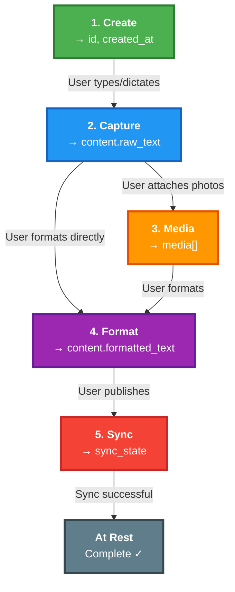
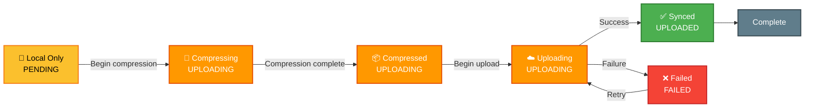
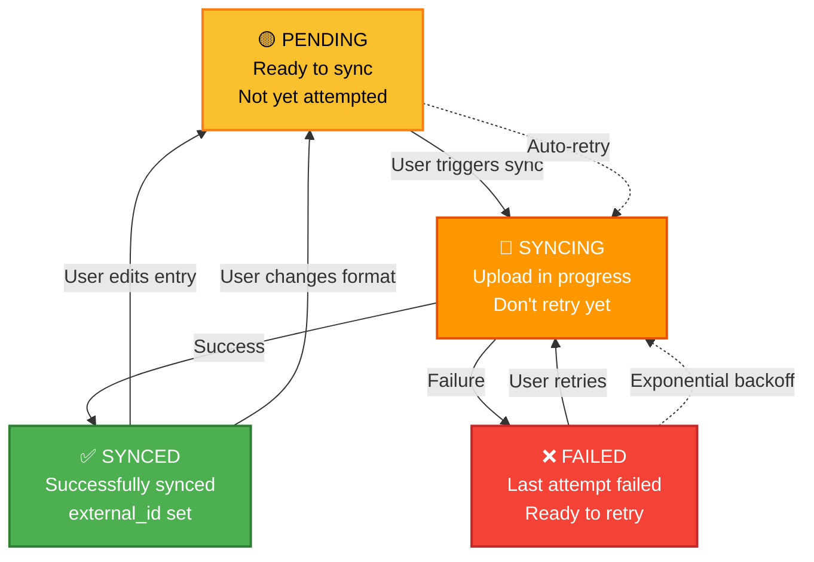

# Domain Models

The `EntryDraft` is the central aggregate root in Codename Promise. All other entities exist to enrich or track the state of this aggregate.

**Note:** These diagrams and model examples are expressed in Python-style naming. The frontend and backend share the same schema and invariants.

## Core Domain Model


## Complete Workflow Visualization



**Key Observations:**

- Steps are not always linear (you can format before attaching media)
- You can repeat steps (format multiple times, add media after formatting)
- Sync is optional and can happen anytime
- Every step persists immediately to SQLite

---

## Aggregate: EntryDraft

The `EntryDraft` is the single source of truth for a journal entry. It is never replaced, only enriched.

### Structure

```python
from dataclasses import dataclass, field
from datetime import datetime
from typing import List, Optional

@dataclass
class EntryContent:
    title: Optional[str] = None
    raw_text: str = ""                         # User's original input (typed or dictated)
    formatted_text: Optional[str] = None        # AI-formatted version

@dataclass
class MediaItem:
    id: str
    type: str                                  # 'photo' | 'video'
    original_path: str
    compressed_path: Optional[str] = None
    original_size_bytes: int
    compressed_size_bytes: Optional[int] = None
    compression_level: str = "none"           # 'none' | 'low' | 'medium' | 'high'
    upload_status: str = "pending"            # 'pending' | 'uploading' | 'uploaded' | 'failed'
    upload_error: Optional[str] = None

@dataclass
class SyncState:
    target: str                                # 'notion' | 'evernote' | 'obsidian'
    external_id: Optional[str] = None          # e.g. Notion page ID
    status: str = "pending"                   # 'pending' | 'syncing' | 'synced' | 'failed'
    last_synced_at: Optional[datetime] = None
    last_sync_error: Optional[str] = None

@dataclass
class EntryDraft:
    id: str
    created_at: datetime
    updated_at: datetime
    content: EntryContent = field(default_factory=EntryContent)
    media: List[MediaItem] = field(default_factory=list)
    sync_state: SyncState = field(default_factory=SyncState)
```

### Invariants (Business Rules)

These invariants are always maintained:

1. **id is immutable** - Never changes after creation
2. **created_at is immutable** - Set only on creation
3. **updated_at changes on every mutation** - Always reflects last change
4. **raw_text persists unchanged** - Never modified by formatting
5. **formatted_text is optional** - Can be empty or None
6. **Media is additive** - Can only add/remove, not modify individual files
7. **Only one sync_state per target** - Can have multiple sync states for different destinations
8. **sync_state tracks external IDs** - Links back to synced destinations

---

## Value Object: EntryContent

Represents the textual content of an entry at different stages of enrichment.

### Composition

```python
content = {
    "title": Optional[str],           # Optional: user-provided title
    "raw_text": str,                  # Required: user's direct input (typed or dictated)
    "formatted_text": Optional[str],  # Optional: AI-structured version
}
```

### Semantics

| Field             | Purpose                       | Source           | Mutability                                |
| :---------------- | :---------------------------- | :--------------- | :---------------------------------------- |
| **title**         | User-provided heading         | Manual entry     | Mutable                                   |
| **raw_text**       | User's unaltered capture      | Typing/Dictation | Mutable (only appended or edited by user) |
| **formatted_text** | Structured & polished version | GPT API          | Mutable (can reformat)                    |

### Methods

```python
def update_raw(self, text: str) -> None:
    """Append or overwrite raw_text after typing/dictation capture."""


def update_formatted(self, text: str) -> None:
    """Set formatted_text from GPT response; can be re-run to reformat."""


def is_empty(self) -> bool:
    """Return True when both raw_text and formatted_text are empty."""
```

---

## Value Object: Media

Represents a single piece of media (photo or video) attached to an entry.

### Composition

```python
media_item = {
    "id": "uuid",                        # Unique identifier
    "type": "photo" or "video",        # MediaType

    # Local storage paths
    "original_path": str,                  # Local filesystem path to original file
    "compressed_path": Optional[str],      # Local filesystem path to compressed version

    # Size tracking
    "original_size_bytes": int,            # Original file size in bytes
    "compressed_size_bytes": Optional[int],
    "compression_level": "none" | "low" | "medium" | "high",

    # Upload tracking
    "upload_status": "pending" | "uploading" | "uploaded" | "failed",
    "upload_error": Optional[str],         # Error message if upload failed
}
```

### Upload Lifecycle



### Compression Strategy

| Level      | Use Case              | Approximate Reduction |
| :--------- | :-------------------- | :-------------------- |
| **NONE**   | Keep original         | 0% (no compression)   |
| **LOW**    | High quality needed   | 20-40%                |
| **MEDIUM** | Standard journaling   | 50-70%                |
| **HIGH**   | Bandwidth constrained | 80-90%                |

---

## Value Object: SyncState

Tracks the synchronization status of an entry with external destinations.

### Composition

```python
sync_state = {
    "target": "notion" | "evernote" | "obsidian",   # Destination service
    "external_id": Optional[str],                        # ID of synced resource (e.g. Notion page UUID)
    "status": "pending" | "syncing" | "synced" | "failed",
    "last_synced_at": Optional[datetime],                # When last successful sync occurred
    "last_sync_error": Optional[str],                    # Error message from last failed sync
}
```

### Sync Status States



### Multiple Sync Targets

An `EntryDraft` can have multiple `sync_state` entries, one per destination:

```python
sync_states = [
    {
        "target": "notion",
        "external_id": "notion-page-uuid-123",
        "status": "synced",
        "last_synced_at": datetime.fromisoformat("2024-01-15T10:30:00Z"),
    },
    {
        "target": "evernote",
        "external_id": "evernote-note-456",
        "status": "synced",
        "last_synced_at": datetime.fromisoformat("2024-01-15T10:32:00Z"),
    },
    {
        "target": "obsidian",
        "status": "failed",
        "last_sync_error": "Connection timeout",
        "last_synced_at": datetime.fromisoformat("2024-01-15T10:20:00Z"),
    },
]
```

---

## Enumerations

### MediaType

```
PHOTO = "photo"
VIDEO = "video"
```

### CompressionLevel

```
NONE = "none"
LOW = "low"
MEDIUM = "medium"
HIGH = "high"
```

### UploadStatus

```
PENDING = "pending"       // Queued for upload
UPLOADING = "uploading"   // Currently uploading
UPLOADED = "uploaded"     // Successfully uploaded
FAILED = "failed"         // Upload failed, needs retry
```

### SyncTarget

```
NOTION = "notion"
EVERNOTE = "evernote"
OBSIDIAN = "obsidian"
```

### SyncStatus

```
PENDING = "pending"       // Not yet synced
SYNCING = "syncing"       // Sync in progress
SYNCED = "synced"         // Successfully synced
FAILED = "failed"         // Sync failed
```

---

## Hydration

The `EntryDraft` is progressively hydrated throughout the journaling workflow. Each user action enriches one or more parts of the aggregate.

### Enrichment Timeline

| User Action       | Fields Updated                        | Before         | After                  |
| :---------------- | :------------------------------------ | :------------- | :--------------------- |
| **Create Draft**  | `id`, `created_at`                     | ∅              | Minimal aggregate      |
| **Type**          | `content.raw_text`, `updated_at`        | Empty          | Has raw text           |
| **Dictate**       | `content.raw_text`, `updated_at`        | Empty          | Has transcribed text   |
| **Edit Text**     | `content.raw_text`, `updated_at`        | Outdated       | Refined input          |
| **Upload Media**  | `media`, `updated_at`                   | No attachments | Media attached         |
| **Format Entry**  | `content.formatted_text`, `updated_at`  | Only raw text  | Raw + formatted        |
| **Publish Entry** | `sync_state.*`, `updated_at`            | Not synced     | Synced with external_id |
| **Retry Sync**    | `sync_state.status`, `sync_state.error` | Failed         | Retry initiated        |

---

## Guiding Principles

### ✅ Never Replace

- The `EntryDraft` is never replaced
- Each operation incrementally enriches the existing aggregate
- Historical data is always preserved

### ⚡ Persist Immediately

- Every mutation is immediately persisted to SQLite
- No in-memory state waiting for sync
- Crashes cannot cause data loss

### 🌍 Synchronization is a Side Effect

- Sync failures never destroy work
- The `EntryDraft` exists independently of Notion
- Sync can always happen later

### 🎯 Single Source of Truth

- The `EntryDraft` in SQLite is canonical
- No scattered state across systems
- All features enrich this single aggregate

### 👤 User's Voice Always Wins

- `raw_text` preserves exact user input
- Formatting never changes user's voice
- AI assists, never authors

---

## Database Schema (SQLite)

```sql
CREATE TABLE entry_drafts (
  id TEXT PRIMARY KEY,
  created_at DATETIME NOT NULL,
  updated_at DATETIME NOT NULL
);

CREATE TABLE entry_contents (
  entry_id TEXT PRIMARY KEY,
  title TEXT,
  raw_text TEXT NOT NULL DEFAULT '',
  formatted_text TEXT,
  FOREIGN KEY (entry_id) REFERENCES entry_drafts(id)
);

CREATE TABLE media (
  id TEXT PRIMARY KEY,
  entry_id TEXT NOT NULL,
  type TEXT NOT NULL, -- 'photo' | 'video'
  original_path TEXT NOT NULL,
  compressed_path TEXT,
  original_size_bytes INTEGER NOT NULL,
  compressed_size_bytes INTEGER,
  compression_level TEXT NOT NULL, -- 'none' | 'low' | 'medium' | 'high'
  upload_status TEXT NOT NULL, -- 'pending' | 'uploading' | 'uploaded' | 'failed'
  upload_error TEXT,
  FOREIGN KEY (entry_id) REFERENCES entry_drafts(id)
);

CREATE TABLE sync_states (
  entry_id TEXT PRIMARY KEY,
  target TEXT NOT NULL, -- 'notion' | 'evernote' | 'obsidian'
  external_id TEXT,
  status TEXT NOT NULL, -- 'pending' | 'syncing' | 'synced' | 'failed'
  last_synced_at DATETIME,
  last_sync_error TEXT,
  FOREIGN KEY (entry_id) REFERENCES entry_drafts(id)
);
```
