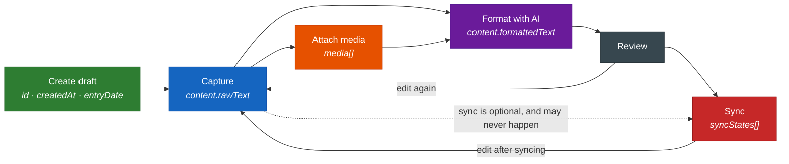
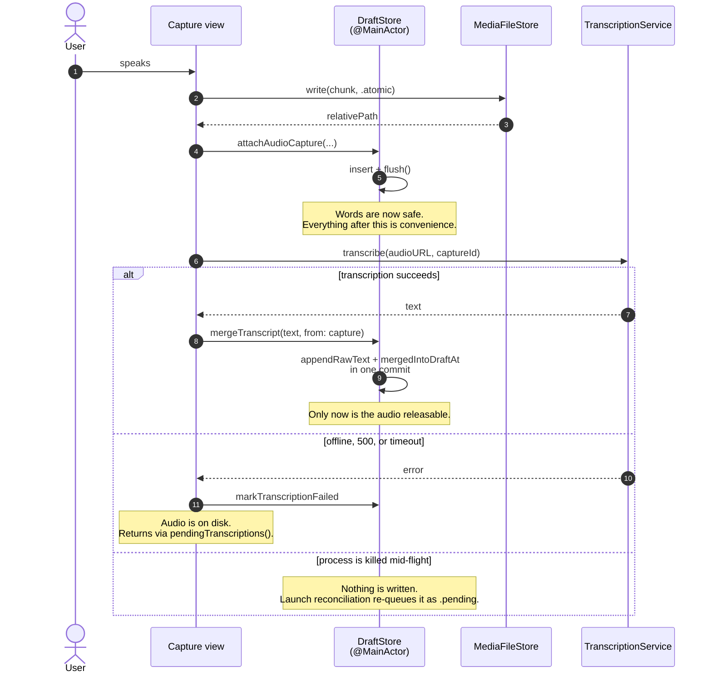
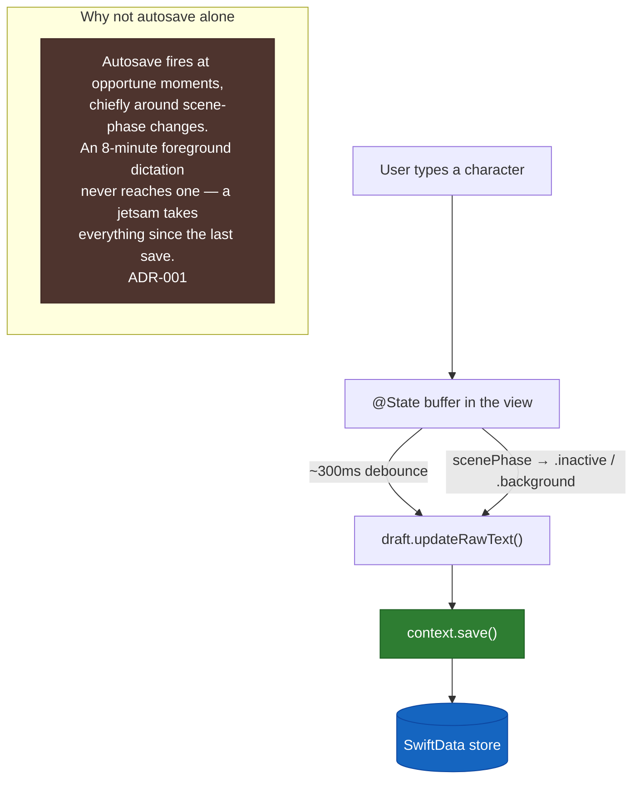
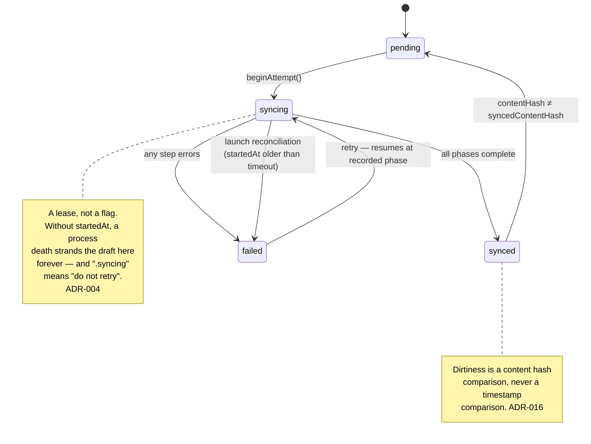
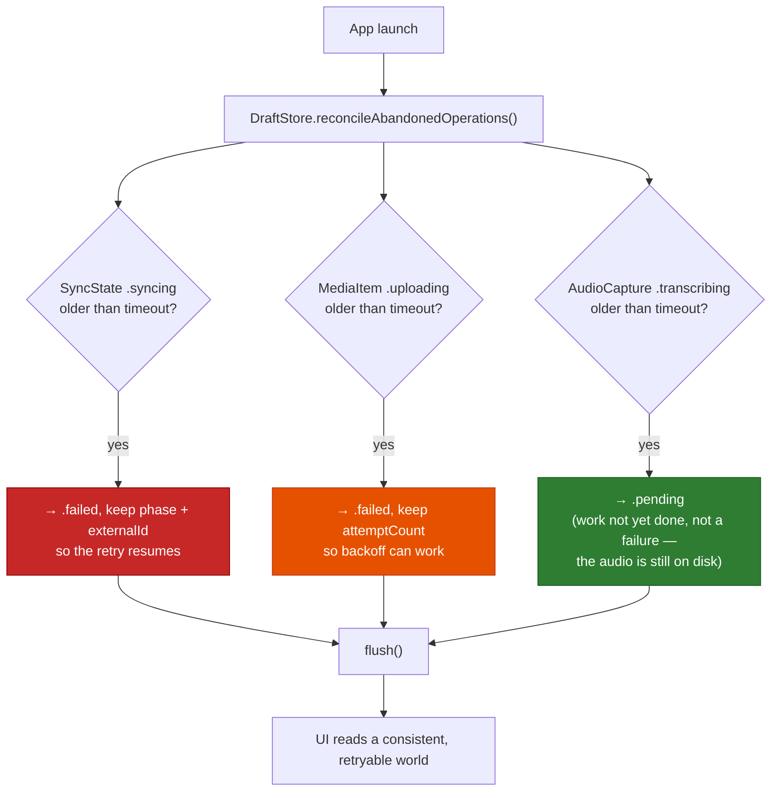
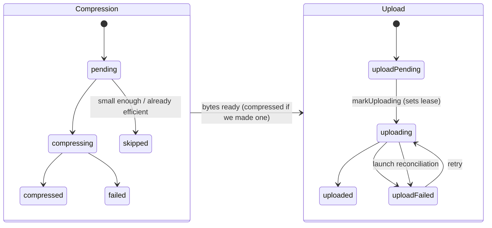

# Flows

Every diagram here is a durability argument. The question each one answers is: *if the
process dies at the worst possible moment, what did the user lose?* The answer must always
be "nothing they said or wrote."

---

## The workflow, and why it isn't a pipeline



Formatting can precede media, can run repeatedly, and sync can happen at any point or
never. A draft that is never synced is a complete, valid, finished entry.

---

## Dictation — the path the project exists for

The original workflow lost dictation when something interrupted it. Audio is written to disk
and committed *before* any network call, so transcription may fail forever without costing
the user their words.



Long dictations record in chunks (`AudioCapture.chunkIndex`) so a failure costs one chunk
rather than the whole session, and chunks append in order.

---

## Durability boundaries



The debounce keeps rapid typing from thrashing the store; the scene-phase flush closes the
window the debounce opens. Every mutating method on `DraftStore` commits before returning.

---

## Sync — resumable and idempotent

```mermaid
sequenceDiagram
    autonumber
    participant Store as DraftStore
    participant State as SyncState
    participant API as NotionAPI

    Store->>State: beginAttempt(contentHash)
    Note over State: Same content → reuse attemptId & phase.<br/>Changed content → fresh key, phases reset.

    opt phase < pageEnsured
        Store->>API: ensurePage(entryDate, key: attemptId:page)
        API-->>Store: pageId
        Store->>State: externalId = pageId; advance(.pageEnsured)
    end

    opt phase < filesUploaded
        loop each media item without a recorded fileId
            Store->>API: uploadFile(key: attemptId:file:<mediaId>)
            API-->>Store: fileId
            Store->>State: recordUploadedFile(mediaId, fileId)
        end
        Store->>State: advance(.filesUploaded)
    end

    opt phase < contentInserted
        Store->>API: insertContent(formattedText, previouslyInsertedBlockIds,<br/>key: attemptId:content)
        Note over API: Replays on a repeated key<br/>rather than inserting twice. ADR-003
        API-->>Store: blockIds
        Store->>State: insertedBlockIds = blockIds; advance(.contentInserted)
    end

    opt phase < propertiesUpdated
        Store->>API: updateProperties(title, entryDate)
        Store->>State: markSynced(externalId, contentHash)
    end

    Note over State: markSynced does NOT bump draft.updatedAt.<br/>Otherwise the draft re-dirties itself forever. ADR-016
```

Each step is skipped when `phase` already covers it, so a retry resumes. Each mutating call
carries a key derived from `attemptId`, so a step whose response was lost replays instead of
writing twice.

Implemented in [`SyncCoordinator`](../../Core/Sources/CodenamePromiseCore/Coordination/SyncCoordinator.swift).
Two behaviours worth knowing that the diagram doesn't show:

- **Media is best-effort.** A photo that fails to upload is marked and skipped; the entry syncs
  regardless. See ADR-015a.
- **The payload is snapshotted before the first `await`.** If the user keeps typing mid-sync,
  the attempt still sends the content its idempotency key was minted for, and the result is
  reported as `syncedButSupersededByEdits` so the draft correctly shows as dirty again.

---

## Sync state machine



---

## Launch reconciliation

Runs once at startup, before any UI reads state.



An interrupted transcription returns as `.pending` rather than `.failed` — presenting
undone work as a failure would be a lie, and the audio never left the disk.

---

## Media lifecycle



Compression and upload are tracked separately because a single combined status could not
distinguish "needs compressing" from "needs uploading" (ADR-013). Compression is planned to
run **on device** — uploading an 800MB original in order to get 80MB back is the wrong shape
for the bandwidth-constrained case that motivated it (ADR-015).

---

## Offline behaviour

Capture and editing never touch the network. Everything that does degrades visibly.

| Capability | Offline | User sees |
|---|---|---|
| Create / type / edit / attach media | Works | Nothing unusual |
| Dictation recording | Works | Nothing unusual |
| Dictation transcription | Queued | "Recorded — will transcribe when online", audio safe |
| AI formatting | Queued | "Will format when online", raw text untouched |
| Sync | Queued | Destination badge shows pending, entry unaffected |

The point is not that everything works offline — it can't. The point is that nothing is ever
*lost* offline, and the user can always tell the difference (ADR-019a).
